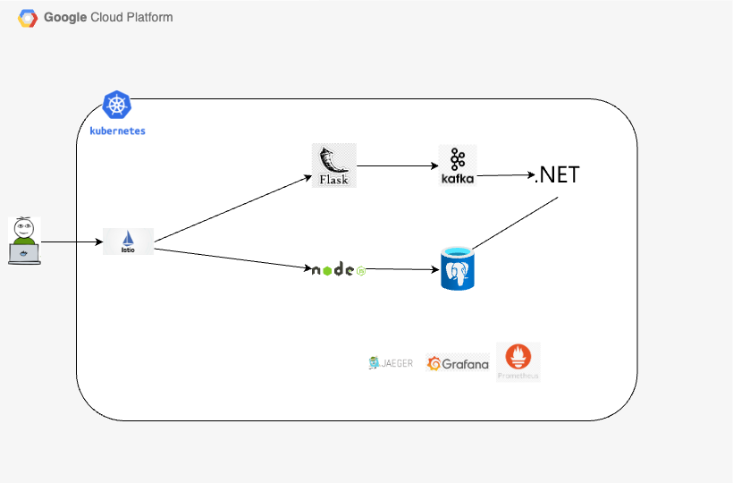

# **Example Voting App - Modern Architecture with Kubernetes**

This repository is an adaptation of the classic [Example Voting App](https://github.com/dockersamples/example-voting-app). The goal was to modernize the application by replacing Redis with Kafka for messaging, implementing modern practices such as Istio for canary deployments, observability with Prometheus, Grafana, Jaeger, and OpenTelemetry, while integrating with Kubernetes and automating deployments via Azure DevOps.

---

## **Architecture**

### Before Modifications


- Redis as the messaging system.
- Simple communication between microservices.
- Manual deployment based on Docker Compose.

### After Modernization



- Kafka replaces Redis for reliable and scalable messaging.
- Fully deployed on Kubernetes.
- Advanced observability with distributed tracing and metrics monitoring.
- CI/CD Pipelines with Azure DevOps.

---

## **Project Objectives**

1. **Modernize architecture:** Replace Redis with Apache Kafka for asynchronous communication.
2. **Scalability:** Use Kubernetes to manage microservices.
3. **Observability:** Integrate Prometheus, Grafana, Jaeger, and OpenTelemetry.
4. **Deployment Automation:** Build complete CI/CD pipelines with Azure DevOps.
5. **Security:** Use CertManager with Let's Encrypt and CloudFlare for HTTPS and Kafka authentication.
6. **Performance Testing:** Validate the application under real-world conditions with JMeter.

---

## **How to Run**

### **1. Requirements**

- **Necessary Tools:**
  - Docker, Helm, kubectl.
  - Kubernetes Cluster (AKS/GKE/EKS).
  - PostgreSQL.
  - Azure DevOps configured with Service Connections.

- **Kubernetes Secrets:**
  - Kafka:
    ```bash
    kubectl create secret generic kafka \
        --namespace=voting-app \
        --from-literal=kafka-bootstrap-server=my-kafka.kafka.svc.cluster.local:9092 \
        --from-literal=kafka-username=user1 \
        --from-literal=kafka-password=<PASSWORD>
    ```
  - CertManager for HTTPS:
    ```bash
    helm install cert-manager jetstack/cert-manager \
        --namespace cert-manager --create-namespace \
        --set crds.enabled=true
    ```

---

### **2. Deployment Steps**

1. **Prepare Kubernetes Environment:**
   - Install kubectl and Docker on the agent machine.
   - Create a service account and configure `imagepullsecret` for the Artifact Registry (Google Cloud).

2. **Modify Application Code:**
   - Replace hardcoded IPs with environment variables.
   - Update Flask and Node.js routes to point to `/vote` and `/result`.

3. **Code Adjustments for Kafka Integration:**
   To replace Redis with Kafka as the messaging system, significant changes were made to the application code across the microservices:

   - **Vote Application (Flask):**
     - Replaced the Redis dependency with `kafka-python`.
     - Added Kafka producer configuration to send messages to the `voting-app-topic`.
     - Modified the routes to utilize Kafka for publishing vote data.
     
     Example snippet from `app.py`:
     ```python
     from kafka import KafkaProducer
        create_kafka_topic("voting-app-topic")
        producer = KafkaProducer(
            bootstrap_servers=kafka_brokers_list.split(','),
            security_protocol='SASL_PLAINTEXT',
            sasl_mechanism='PLAIN',
            sasl_plain_username=kafka_username,
            sasl_plain_password=kafka_password,
            value_serializer=lambda v: json.dumps(v).encode('utf-8'),
            api_version=(2, 7, 0) 
        )
     producer.send('voting-app-topic', {'voter_id': voter_id, 'vote': vote})
     ```

   - **Worker Application (.NET):**
     - Integrated Kafka consumer to process messages from `voting-app-topic`.
     - Configured SASL authentication for secure communication.
     - Replaced Redis logic with a Kafka consumer and PostgreSQL for persistence.

     Example snippet from `Program.cs`:
     ```csharp
     var config = new ConsumerConfig
     {
         BootstrapServers = Environment.GetEnvironmentVariable("KAFKA_BOOTSTRAP_SERVER"),
         GroupId = "worker-group",
         AutoOffsetReset = AutoOffsetReset.Earliest,
         SaslMechanism = SaslMechanism.Plain,
         SecurityProtocol = SecurityProtocol.SaslPlaintext,
         SaslUsername = Environment.GetEnvironmentVariable("KAFKA_USERNAME"),
         SaslPassword = Environment.GetEnvironmentVariable("KAFKA_PASSWORD"),
     };
     ```

   - **Result Application (Node.js):**
     - Updated API to fetch results directly from PostgreSQL instead of Redis.
     - Simplified the real-time results logic to use periodic polling from the database.

---

4. **Install Helm Charts:**
   - **Istio Gateway**:
     ```bash
     kubectl apply -f k8s-specifications/istio-gateway.yaml
     ```
   - **Prometheus + Grafana**:
     ```bash
     helm repo add prometheus-community https://prometheus-community.github.io/helm-charts
     helm install kube-prometheus prometheus-community/kube-prometheus-stack -n monitoring --create-namespace
     ```
   - **Kafka**:
     ```bash
     helm repo add bitnami https://charts.bitnami.com/bitnami
     helm install my-kafka bitnami/kafka --namespace kafka --create-namespace
     ```

5. **Configure Canary Deployments:**
   - Apply Istio VirtualService and DestinationRules:
     ```bash
     kubectl apply -f k8s-specifications/dest-rules.yaml
     kubectl apply -f k8s-specifications/vote-vservice.yaml
     ```

6. **Enable Observability:**
   - Install Jaeger for tracing:
     ```bash
     helm repo add jaegertracing https://jaegertracing.github.io/helm-charts
     helm install jaeger jaegertracing/jaeger --version 0.73.1 -n monitoring
     ```
   - Add OpenTelemetry collector:
     ```bash
     helm repo add open-telemetry https://open-telemetry.github.io/opentelemetry-helm-charts
     helm install my-opentelemetry-collector open-telemetry/opentelemetry-collector -n monitoring
     ```

7. **Set Up Horizontal Pod Autoscaler (HPA):**
   - Configure HPA for the vote service after performance testing:
    ```bash
    kubectl apply -f k8s-specifications/hpa-vote.yaml
    ```

8. **Integrate CertManager with Cloudflare for DNS Management:**
   - Create an API token in Cloudflare with "Edit Zone DNS" permissions.
   - Create a Kubernetes secret for the Cloudflare API key:
     ```bash
     kubectl create secret generic cloudflare-api-key-secret \
         --from-literal=api-key=<CLOUDFLARE_API_KEY>
     ```
   - Apply the ClusterIssuer:
     ```yaml
     apiVersion: cert-manager.io/v1
     kind: ClusterIssuer
     metadata:
         name: letsencrypt-dns01-issuer
     spec:
         acme:
             server: https://acme-v02.api.letsencrypt.org/directory
             email: you@example.com
             privateKeySecretRef:
                 name: letsencrypt-dns01-private-key
             solvers:
             - dns01:
                 cloudflare:
                     email: you@example.com
                     apiTokenSecretRef:
                         name: cloudflare-api-key-secret
                         key: api-key
     ```

9. **Performance Testing with JMeter:**
   - Gradual load tests with:
     - **Number of Threads (Users):** 10,000.
     - **Ramp-Up Period (Seconds):** 50.
     - **Loop Count:** 20.
   - Confirmed the `vote` pod handles up to **300m CPU**.

---

## **Observability**

### **Dashboards in Grafana**

1. **Istio Control Plane Dashboard (ID: 7645).**
2. **Istio Mesh Dashboard (ID: 7639).**
3. **Kubernetes Nodes Dashboard (ID: 15759).**

### **ServiceMonitors for Prometheus**
- Created ServiceMonitors for the `vote` and `worker` services to collect custom metrics.

### **Distributed Tracing**
- Jaeger deployment:
  ```bash
  helm install jaeger jaegertracing/jaeger --version 0.73.1 -n monitoring
  ```

### ***Configured OpenTelemetry for instrumentation and tracing.***  
---

## Learnings and Improvements

- **Kafka:** Restructured communication between services to use Apache Kafka, increasing reliability.
- **Canary Deployments:** Incremental testing with new versions.
- **Distributed Tracing:** Detailed monitoring of request flows.

